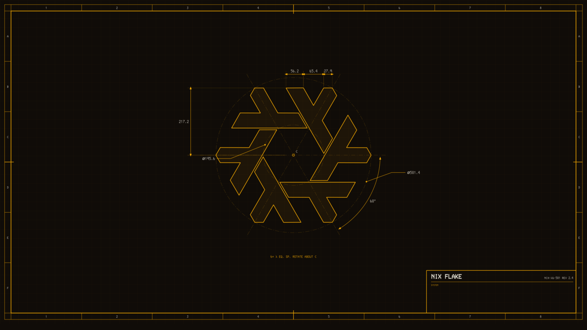
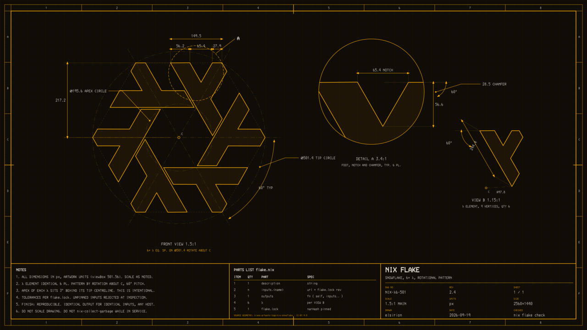
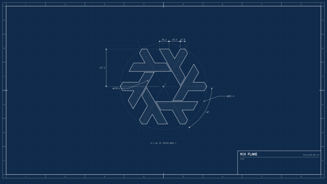
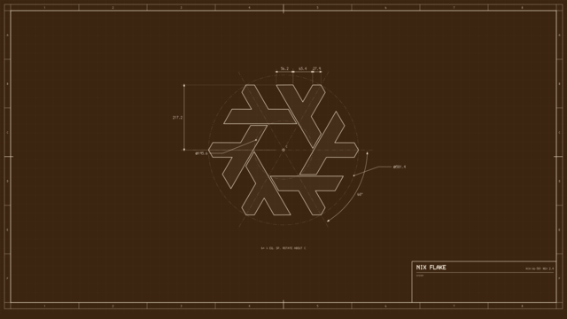

# Nix flake as an engineering drawing

Wallpaper generator: the Nix snowflake drawn as a dimensioned engineering sheet.
Amber phosphor, Van Dyke brown print, or blueprint colour schemes.



Geometry is extracted from the official logo in
[nixos-artwork](https://github.com/NixOS/nixos-artwork) (`logo/nix-snowflake-white.svg`),
so every dimension on the sheet is the real one: six lambdas on a Ø501.4 tip circle,
apexes on Ø195.6, foot flats at 217.2 from centre (exactly R·√3/2), 60° pitch.
Units are the artwork's own pixels.

## Sheets

**minimal** (above): the flake centred with five dimensions and a title block whose
lower field is left empty for live system stats. The bottom 26 px are kept clear for a bar.

**full**: front view 1.5:1, detail A of a foot, view B of one lambda, notes, a parts
list reading `flake.nix` as a bill of materials, and a complete title block.



| blueprint | vandyke |
|---|---|
|  |  |

## Render

    ./render.sh            # every scheme and size into out/
    python3 flake_drawing.py amber > amber.svg
    python3 flake_drawing.py blueprint --minimal --size=2057x1371 > laptop.svg

Schemes: `amber`, `vandyke`, `blueprint`. Add one to `SCHEMES` in the script.
`--size=WxH` renders the sheet for an output's logical size; the title block is placed
relative to the bottom right corner, so the widget offsets below stay the same.
Text uses the 3270 Nerd Font with IBM 3270 / Share Tech Mono fallbacks; rasterise with a
font-aware renderer (`magick` via librsvg) on a machine that has one of them.

## Filling the SYSTEM field

The wallpaper is static. The empty field under "SYSTEM" in the title block is meant
for a layer-shell widget that sits between the wallpaper and your windows.
With [eww](https://github.com/elkowar/eww) on sway that is a window with
`:stacking "bottom"` anchored to the bottom right:

```lisp
(defpoll st :interval "10s" `./stats.sh`)      ; prints one JSON object

(defwindow stats
  :monitor "DP-9" :stacking "bottom" :exclusive false :focusable false
  :geometry (geometry :anchor "bottom right"
                      :x "60px" :y "56px" :width "620px" :height "102px")
  (box :orientation "v" :space-evenly false
    (label :xalign 0 :text "CPU  ${st.cpu}%   MEM  ${st.memu} / ${st.memt} GiB")
    (label :xalign 0 :text "VPN  ${st.vpn}   UP  ${st.up}")))
```

The offsets come from `stats_box()` in the script: the field is 632 × 130 px, its right
edge 48 px from the screen edge and its bottom 74 px above the bar line (26 px bar).
`x 60 / y 56` with a 620 × 102 window lands inside it with a small margin.
`examples/` holds the complete eww config used with this wallpaper: `stats.sh`
gathers CPU, temperature, memory (including amdgpu GTT), disk, uptime, VPN relay,
LAN address and agent counts; `eww.yuck` defines one window per monitor;
`eww.scss` sets the font and the amber colours. Start it from sway with
`exec_always eww open stats`. Any other layer-shell tool works the same way,
conky ≥ 1.19 for example with `own_window_type = 'desktop'`.

## Licence

Snowflake geometry: NixOS logo, CC-BY 4.0, NixOS contributors.
Everything else: MIT.
